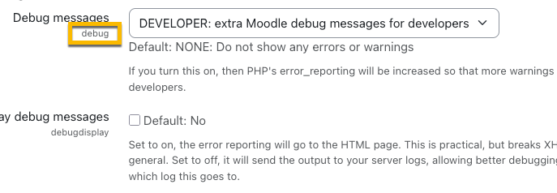

# Introduction
A linux or Macos set of bash script to automate the installation of Moodle and [DDEV](https://ddev.com/) developement environements.
(it should work on windows with small adjustments).

__moodle-ddev.sh__  
Install moodle instance with ddev for development. 
(without the need to setup a local web server apache or nginx neither the DB engine)
- choose your php version
- choose your moodle version
- choose your DB (mariadb|mysql|postgres)
- choose the directory where you want it installed.
- pass a CSV table with all the admin settings you want to set.
- Start developping and testing in less than a minute using a clean moodle install ready under ddev generated url on your locahost.

__moodle-ddev_delete.sh__ 
Delete a single Moodle [DDEV](https://ddev.com/) install

__run_all.sh__
Run several install in batch by passing a list of moodles, phps or dbs.
__delete_all.sh__
Remove all installs in batch.

## Dependencies

### DDEV v1.21+
[DDEV](https://ddev.com/) _Container superpowers with zero required Docker skills: environments in minutes, multiple concurrent projects, and less time to deployment._

### DOCKER
When installing ddev you would also need a docker install follow the get started https://ddev.com/get-started/

### COMPOSER
https://getcomposer.org/

### JQ
JSON parser to get ddev variables to pass it to the moodle cli admin install.
(The moodle fullname and short name will be based on install name using given versions and db type)

MAC:
https://formulae.brew.sh/formula/jq
LINUX:
https://jqlang.org/

## Setup

### Executables
make sure the needed scripts are executable:
```bash
chmod +x ./moodle_ddev.sh
chmod +x ./moodle_ddev_delete.sh
chmod +x ./moodle_ddev.sh
```

### ENV (optional)
If you whish add a global MOODLE_DDEVS_DIR env variable with the main root folder where you want you ddev install to sit in.

## moodle-ddev.sh

### Params

__--version__ (moodle version in 'stable' or 'minor' format. 4.1, 401, 4.2.1 etc. ).  
__--php__ (php version from 8.0 to 8.4).
__--db__ (mariadb|mysqli|pgsql). OPTIONAL, defaults to mariadb.  

__--root__ OPTIONAL, If not passed than the script will do the install in MOODLE_DDEVS_DIR env variable, if set else, at the same level the script is launched.
__--admincfg-csv__ OPTIONAL, You can pass a simple CSV file with all the admin config you'd like to be pre set. The file must have NAME,VALUE header,. Expl :
```
NAME,VALUE
debug,30719
cachejs,0
langlist,"de,fr,en"
```

You can use any name found in the admin (unless from a additinal plugin)


__--force__ Use this if you want to override an existing installation. OPTIONAL.  

```bash
./moodle_ddev.sh --php <version> --version <moodle_version> [--db <mariadb|mysql|postgres>] [--force] [--root <folder>]
```

Expl :

```
./moodle_ddev.sh --php 8.4 --version 501
```

```bash
./moodle_ddev.sh --php 8.4 --version 501 --db postgres --root ~/dev/moodles
```

### Interactive mode
You can also run it without parameters,
The script will ask you to enter each value one by one.

```bash
./moodle_ddev.sh
```
Then you'll be prompted to enter the parameters.
There are default values in (parenthesis).

### Install directories naming and sctructure
The projects main folder will be named with the moodle, the php and the db versions :

```
├── moodle4.3.2-php8.2-mariadb
│   ├── moodle
│   └── moodledata
├── moodle405-php8.4-postgres
│   ├── moodle
│   └── moodledata

#### 5.1 structure
├── moodle501-php8.4-mysql
│   ├── moodle
│   |    ├── ...
│   |    └── public
│   └── moodledata
```

## run_all.sh

If no parameter are given

The script will create all combinaisons of :  
__Arrays of versions__
MOODLE_VERSIONS=("401" "402" "403" "404" "405" "500" "501")
PHP_VERSIONS=("7.4" "8.0" "8.1" "8.2" "8.3" "8.4")
DB_TYPES=("mariadb" "mysqli" "pgsql")

### Params

__--moodle__ space-separated subset list of moodle versions.
__--php__ space-separated subset list of php versions.
__--db__ space-separated subset list of db types.
__--moodle-csv__ space-separated subset list of moodle versions.
__--php-csv__ space-separated subset list of php versions.
__--db-csv__ space-separated subset list of db types.

__--root__ The parent folder (OPTIONAL).
__--force__ overrwrite fodlers if same names are found (OPTIONAL).

### Count of instances limit

If you exceed the number of ip, you can face an error 
```
failed to create network ddev-moodleXXX-phpYY-ZZZ: Error response from daemon: all predefined address pools have been fully subnetted
```
you can configure Docker to have more IP ranges:

Edit or create /etc/docker/daemon.json (or Docker Desktop settings → Docker Engine):
```
JSON{  "default-address-pools": [    {"base":"172.80.0.0/16","size":24},    {"base":"172.90.0.0/16","size":24}  ]}Show more lines
```

Restart Docker after saving.

(Check dockers/ddev docs for more on that)

## moodle_ddev_delete.sh

use the moodle_ddev_delete.sh to remove an installation cleany.

```
moodle_ddev_delete.sh <main_folder_path>
```

Expl:
```
├── moodle501-php8.4-mysql
│   ├── moodle
│   |    ├── ...
│   |    └── public
│   └── moodledata

moodle_ddev_delete.sh /PATH_TO_THE_FOLDER/moodle501-php8.4-mysql

```

## delete_all.sh
The script will unset all ddev projects found with the combinaisons of :  
__Arrays of versions__
MOODLE_VERSIONS=("401" "402" "403" "404" "405" "500" "501")
PHP_VERSIONS=("7.4" "8.0" "8.1" "8.2" "8.3" "8.4")
DB_TYPES=("mariadb" "mysqli" "pgsql")

### Params

__--root__ The parent folder (OPTIONAL).

## Todo
- add moodle plugins
- add behat and phpunit setup
- add mounts
- add prefered ide default basic template setup